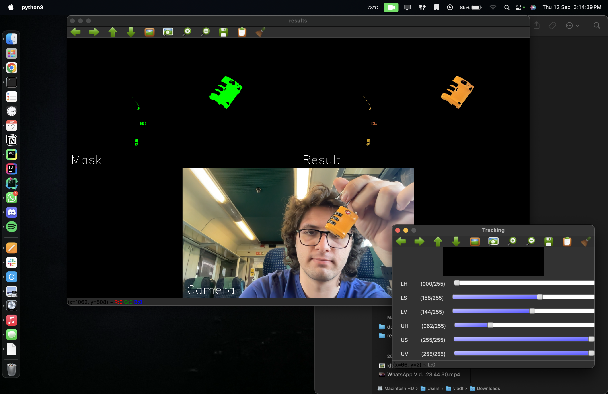

# Color range finder 🌈 
This script can be used for searching color ranges based on their HSV values! 

## _Contents_
- [Burden](#burden)
- [How does it work?](#how-does-it-work)
- [Install](#install)
- [Script setup](#script-setup)
- [How to run it?](#how-to-run-it)
- [Credits](#credits)

## _Burden_
For a color detection implementation, it's hard to determine what the exact color should be detected. This happens 
because of different types of cameras, that have different setups and color gradings. 

This script can help you determine the color ranges for some specific colors that you may be looking in another program. 

## _How does it work?_
If you want to know everything about how this works, you need to check up the following links: 
- [Video and frame processing in Computer Vision (TBA)]()
- [Color formats and pixels (TBA)]()
- [Masks (TBA)]()

Now that you know all of those things, the script works quite simple. We're trying to find 2 color values and to create 
a range from them. 

<br>

After finding the range limits, we will be looking to create a mask. By creating a mask, if a pixel's color is in that 
specific range, that pixel represents the color we're looking for. In the mask, we will transform that pixel in a white 
one. If not, that pixel will be a black one. 

<br>

By looking at the mask, you can easily determine which is the color you're looking for.

## _Install_
This is a Python script, so firstly you need to have Python 3.11 installed.

To install all the Python packages that are used for this project, you need to run the next commands. 

```bash
pip install opencv-python
pip install numpy
```

## _Script setup_
If the script does not run or shows a black screen instead of your beautiful face, the camera should be set. You can 
easily do that by changing the value of this method to 0 or 1. 

```python 
cap = cv2.VideoCapture(0)
```

After that, you should not have any issue regarding the setup. 

## _How to run it?_
Simply, just type this command:

```bash
python3 T13_Track_object_in_stream.py
```

After that, 2 windows will be open: one with lots of trackbars that you can set and one where you can see the output. 

<br>

And there you go! You can play around with the trackbars until you have found the right values. After that, you need to 
write them somewhere and to add them into your code!



## _Credits_
This algorithm was initially written by [Cristian Moldovan](https://mctr.mec.upt.ro/personal/cristi-moldovan/) (Departamentul de Mecatronica @ Facultatea de Mecanica UPT
) . Thanks to his knowledge sharing, this script helped the WizzTech robotics team through the last 3 years. 